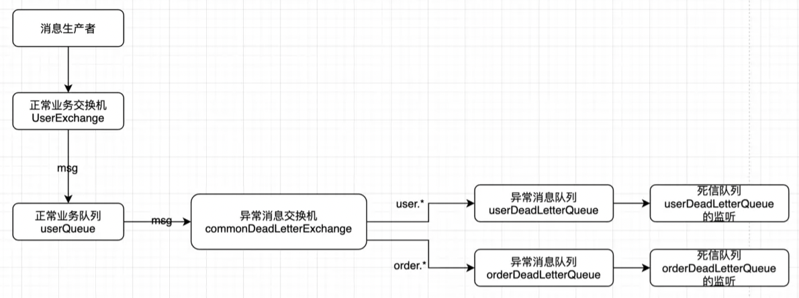
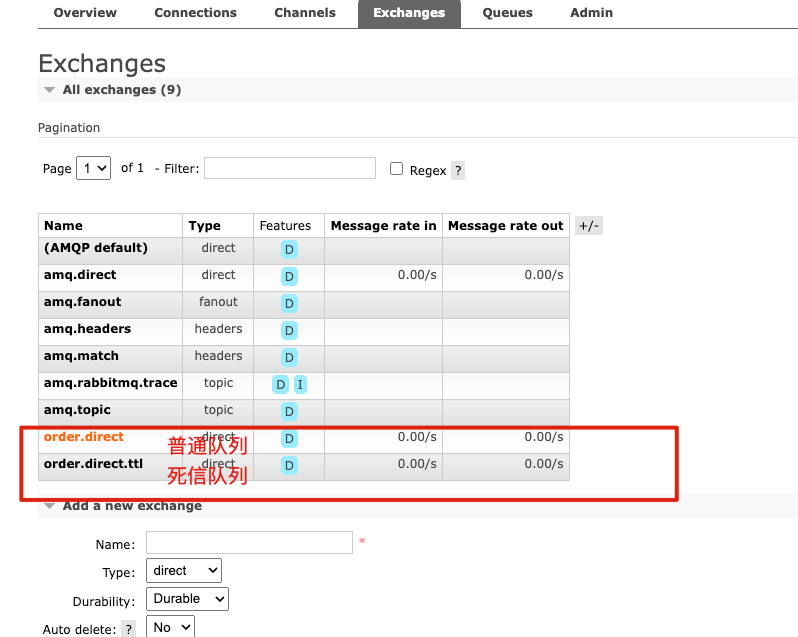
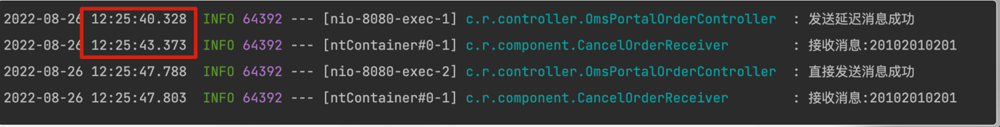

# RabbitMQ 队列 (普通/死信队列)

## 概念
#### 消息会变成死信消息的场景
1. 消息被 `(basic.reject() or basic.nack()) and requeue = false`，即消息被消费者拒绝签收，并且重新入队为false。 
   - 有一种场景需要注意下：消费者设置了自动ACK，当重复投递次数达到了设置的最大`retry`次数之后，消息也会投递到死信队列，但是内部的原理还是调用了`nack/reject`。
2. 消息过期，过了TTL存活时间。
3. 队列设置了`x-max-length`最大消息数量且当前队列中的消息已经达到了这个数量，再次投递，消息将被挤掉，被挤掉的是最靠近被消费那一端的消息。

#### 代码编写流程:
1. 有一个(n个)正常业务的Exchange，比如为`user-exchange`。
2. 有一个(n个)正常业务的Queue，比如为`user-queue`。（因为该队列需要绑定死信交换机，所以需要加俩参数：死信交换机:`x-dead-letter-exchange`，死信消息路由键:`x-dead-letter-routing-key`）
3. 进行正常业务的交换机和队列绑定。
4. 定义一个死信交换机，比如为`common-dead-letter-exchange`。
5. 将正常业务的队列绑定到死信交换机(队列设置了`x-dead-letter-exchange`即会自动绑定)。
6. 定义死信队列`user-dead-letter-queue`用于接收死信消息，绑定死信交换机。

#### 业务流程
1. 正常业务消息被投递到正常业务的Exchange，该Exchange根据路由键将消息路由到绑定的正常队列。
2. 正常业务队列中的消息变成了死信消息之后，会被自动投递到该队列绑定的死信交换机上（并带上配置的路由键，如果没有指定死信消息的路由键，则默认继承该消息在正常业务时设定的路由键）。
3. 死信交换机收到消息后，将消息根据路由规则路由到指定的死信队列。
4. 消息到达死信队列后，可监听该死信队列，处理死信消息。
- `死信交换机`、`死信队列`也是普通的交换机和队列，只不过是我们人为的将某个交换机和队列来处理死信消息。

#### 业务流程图


## 配置
#### 相关依赖
```xml
<!--    安装mq依赖    -->
<dependency>
   <groupId>org.springframework.boot</groupId>
   <artifactId>spring-boot-starter-amqp</artifactId>
</dependency>

<dependency>
   <groupId>org.projectlombok</groupId>
   <artifactId>lombok</artifactId>
   <optional>true</optional>
</dependency>
```   

#### 配置文件
```yaml
spring:
   application:
      name: delay-rabbitmq
   rabbitmq:
      host: 127.0.0.1
      port: 5672
      username: guest
      password: guest
      virtual-host: /
      # 路由失败回调
      publisher-returns: true
      publisher-confirms: true

```

#### MQ后台设置
- 按照`enum`新建两个交换机, 队列不需要手动设置,启动项目会自动创建



## 测试
#### 直接发送消息
```shell
curl http://localhost:8080/send-message
```

#### 发送延迟3秒的消息
```shell
curl http://localhost:8080/delay-message
```


